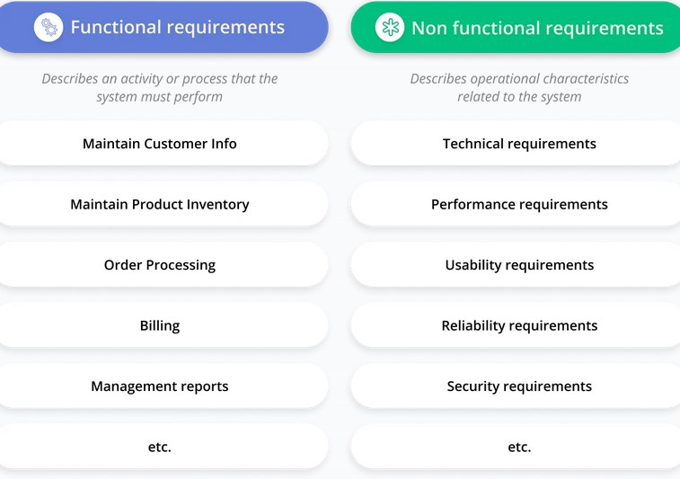

# Plan

The website name will be SPOR Casino (Romanian derivative from good luck)

Learn to use Next.js (react framework) and maybe do some simple stuff with it

## This will be a sport betting website, which will include games such as -

- Blackjack
- Horse racing (Like the car racing game)
- Roulette? (unsure how hard the concept will be)

{ - Depending on the time I might be able to integrate poker, although I seriously need to study
poker rules and cards, together with possible combinations }

- Slots
- Daily wheel of fortune for credits AND wheel of fortune based on inserted amount of coins
- Bingo

## I WILL HAVE TO look into requirements ( SEE PICTURE )

I will have user side req. and website side req.

Introduce chip system instead of money system, or credits than can be converted to chips and vice versa

Introduce some games the users can play for credits

## Introduce database for the following

- Login System (id, username, password, email)
- CREDITS (fk id, credits, chips)
- WINS_LOSSES (fk id, win_nr, loss_nr)
- WINS_LEADERBOARD (fk id, [sort the users by winnings], fk win_nr)

